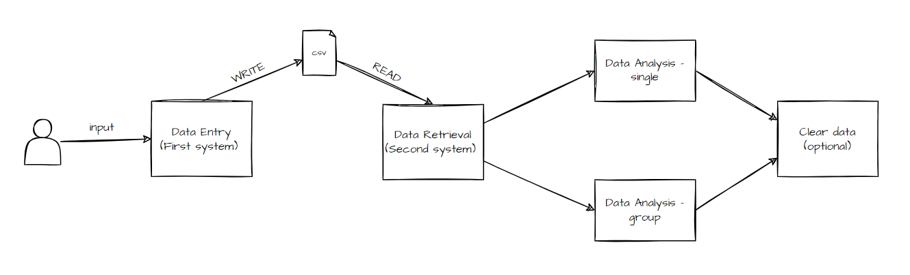

# Covid Data Analysis System
## Task Brief Description
The World Health Organisation (WHO) have hired you to develop a software system made up of two components, to manage and analyse COVID-19 data. <br> 
You will build two software systems. One system will allow the user to input nations’ data and store this data in a CSV file. The second system will read the data back into a 
program and perform various analyses on it. <br>

> Disclaimer: This program is for educational purposes and not designated for production. The code may 
> contain bugs. 
## System Overview 


## Prerequisites
- Java Development Kit (JDK) 11 or later (<a href="https://www.oracle.com/java/technologies/downloads/">Download JDK</a>)
- Unix-like environment (optional)

## Technologies
- Java SE
- Bash script

## Run the program
Clone the repository 
```
https://github.com/YU88John/pdi-final-asm.git
```

Go into the code directory
```
cd system_code/src
```

Start the program in one click with shell script 
``` 
./oneclick.sh
```
- If it shows `not executable`, add permissions to the file: `chmod +x oneclick.sh`

***

## First System 

In brief, this system requires:
- User Input for 6 values
- Data validation (e.g. non-empty values)
- Data storage (`.csv` format)

We will break down the deliverables to two task:
- Data input and alidation
- Data transform into `csv`

### `DataEntry.java`
This class serves as a coordinator for user interaction, data input, display, and CSV file writing, using modular components for different aspects of the functionality.

1. **User Input Handling:**
  - Prompts the user to enter the number of nations.
  - Creates an instance of the `UserInputHandler` class, passing a `Scanner` object to it.
  - Calls the `collectUserInput` method of the `UserInputHandler` instance, collecting details for each nation, including country name, national code, detected cases, deaths, and continent.

2. **Display Entered Data:**
  - Retrieves the entered data (country names, national codes, detected cases, deaths, continents) from the `UserInputHandler` instance.
  - Asks the user to enter a file name for the CSV file.

3. **Display Entered Data (Continued):**
  - If a valid file name is provided:
    - Displays the entered data for each nation:
      - Nation number, country name, national code, detected cases, deaths, and continent.

4. **CSV File Writing:**
  - Calls the `askFileName` method of the `CSVWriter` class to get the CSV file name.
  - Calls the `inputToCSV` method of the `CSVWriter` class, passing the entered data (country names, national codes, detected cases, deaths, continents) and the file name to write the data to a CSV file.

5. **Error Handling:**
  - Checks if the entered file name is valid (not null).
  - If the file name is invalid, prints an error message indicating that an invalid file name was provided.

6. **Resource Cleanup:**
  - Closes the `Scanner` to release system resources.

7. **Modular Structure:**
  - Utilizes the `UserInputHandler` and `CSVWriter` classes to encapsulate specific functionalities.
  - Promotes a modular structure for better code organization, readability, and maintainability.

### `UserInputHandler.java`
This class encapsulates the functionality of collecting user input for multiple nations, ensuring data integrity and validation. 
It also provides methods to retrieve the collected data for further use. The class promotes code modularity and separation of concerns.

1. **Constructor:**
    - Takes a `Scanner` object as a parameter during instantiation.
    - Initializes the `scanner` field with the provided `Scanner`.

2. **User Input Collection:**
    - Collects input for a specified number of nations.
    - Initializes arrays (`countryNames`, `nationalCodes`, `detectedCases`, `deaths`, `continents`) based on the number of nations.
    - Utilizes the `ValidityChecks` class for input validation during collection.

3. **Input Collection (Per Nation):**
    - For each nation, prompts the user to enter details using methods from `ValidityChecks`:
        - Country name (non-empty, trimmed).
        - National code (non-empty, trimmed).
        - Detected cases of COVID (positive integers only).
        - Deaths from COVID (positive integers only, not greater than detected cases).
        - Continent (validated against a predefined set: "EU", "AF", "AS", "NA", "SA", "AU", "OT").

4. **Input Validation (via ValidityChecks):**
    - Ensures that country name and national code are non-empty.
    - Ensures that detected cases and deaths are positive integers.
    - Ensures that deaths are not greater than detected cases.
    - Validates continent input against a predefined set.

5. **Data Retrieval Methods:**
    - Provides getter methods (`getCountryNames`, `getNationalCodes`, `getDetectedCases`, `getDeaths`, `getContinents`) to retrieve the collected data.

### `ValidityChecks.java`
This class provides a reusable method for validating inputs against a predefined rules. 
The `static` nature of the method allows it to be used without instantiating the class, making it convenient for validation purposes.

1. **Static Method:**
    - The methods are declared as `static`, indicating that they can be called on the class themselves without creating an instance of the class.

2. **Validate Country Name:**
    - Prompts the user to enter a country name until a valid non-empty string is provided.
    - Checks if the entered string is a valid integer; if true, prompts the user to enter a valid string for the country name.
    - Handles cases where the country name is empty.

3. **Validate National Code:**
    - Prompts the user to enter a national code until a valid non-empty string is provided.
    - Checks if the entered string is a valid integer; if true, prompts the user to enter a valid string for the national code.
    - Handles cases where the national code is empty.

4. **Validate Detected Cases:**
    - Prompts the user to enter the number of detected COVID cases until a valid positive integer is provided.

5. **Validate Deaths:**
    - Prompts the user to enter the number of deaths until a valid positive integer is provided.
    - Ensures that the number of deaths is not greater than the number of detected cases.

6. **Validate Continent:**
    - Prompts the user to enter a continent code (EU, AF, AS, NA, SA, AU, OT) until a valid continent is provided.
    - Uses the `isValidContinent` method for validation against a predefined set of valid continents.

7. **Helper Method: `isInteger()`:**
    - Checks if a given string can be parsed into an integer.
    - Used in country name and national code validation to ensure that the input is not a numeric value.


***

The second task is to write the user input into `.csv`(comma-separated values) form. This method accepts 5 values for data translation as given as a sample in the question
(`Country Name, National Code, Detected Cases, Number of Deaths, Continent - Qatar, QA, 5001, 1109, AS)`. For `PrintWriter` and `try-catch` that are used in this method, we will
need to import some packages from `java.io` package. The packages used in this system includes `File, FileNotFoundException, PrintWriter`. You can read more about the used packages
<a href="https://docs.oracle.com/javase/8/docs/api/java/io/package-summary.html">here</a> . <br>
In Java, there are multiple ways to write input data to a `.csv` file. However, we will use `PrintWriter` (similar reason as why we create `Scanner` for inputs) in this system as
the question already mentions to use it. You can read more about `PrintWriter` <a href="https://docs.oracle.com/javase/8/docs/api/java/io/PrintWriter.html">here</a>. <br>
In our code, we will create a `PrintWriter` called `writer`. The `PrintWriter` will automatically create(if not exist) or replace the data(if exists). 
The implementation is learnt but not directly referenced from <a href="https://youtu.be/dHZaqMmQNO4?si=4JdenfOMmTbmzyNd">this video</a>.<br>

### `CSVWriter.java`
This class encapsulates methods for obtaining a CSV file name from the user and writing data to a CSV file.
It follows a static approach, allowing its methods to be called without instantiating an object of the class.

1. **File Name Input:**
    - The `askFileName` method prompts the user to enter a CSV file name.
    - Uses a `Scanner` object to get user input.
    - Consumes an extra line to prevent potential issues with reading newline characters.
    - Trims the entered file name, checks if it's empty, and returns the full file name with a `.csv` extension or `null` if the entered name is empty.

2. **CSV Data Writing:**
    - The `inputToCSV` method writes data to a CSV file.
    - Takes parameters:
        - `fullFileName`: The full path and name of the CSV file.
        - Arrays of data (`countryNames`, `nationalCodes`, `detectedCases`, `deaths`, `continents`).
    - Uses a try-with-resources statement to automatically close the `PrintWriter` after writing data to the file.
    - Writes headers and data to the CSV file based on the provided arrays.
    - Prints a confirmation message if the data is successfully written.
    - Handles a `FileNotFoundException` by printing the stack trace if some internal(e.g. filesystem, insufficient permissions) errors occur


***

*This functionality is deprecated in the latest update due to the decision of storing all the source codes under the same directory*


### ~~`copyCSVFile()` method~~
~~This is actually not included in the task description. However, I thought it would be better if the `csv` file is copied
into the Analysis directory every time the `DataEntry.java` is run, and the data is updated. In this way,
components become more dynamic and flexible. How? Imagine a scenario where the database team planned to output the `csv`
file to their working directory for some data warehouse purposes. Will you write the whole java code just to read the 
`csv` file from another directory? Absolutely, no! For such case, we can use
<a href="https://docs.oracle.com/javase/tutorial/essential/io/copy.html">Files.copy method</a>, together with 
<a href="https://docs.oracle.com/javase/8/docs/api/java/nio/file/Path.html">Path</a>. I used JDK 17 for this project but 
if your JDK is lower than 11, please use <a href="https://docs.oracle.com/javase/8/docs/api/java/nio/file/Paths.html">Paths</a> instead.~~ <br>

~~This method is simple as it is implemented as it is according to official java documentations. <br>
Create path variables for source and destination~~
- ~~`Path source = Path.of(sourcePath);`~~ 
- ~~`Path destination = Path.of(destinationPath, "covidData.csv");`~~
 <br>

~~Copy the files using the above variables:~~ 
- ~~`Files.copy(source, destination, StandardCopyOption.REPLACE_EXISTING);`~~
<br> ~~`REPLACE_EXISTING` will replace the file if `covidData.csv` already exists in the destination directory. If you plan to add 
instead of overwriting, please use `.APPEND` instead. However, I would not recommend this for `csv` files due to formatting.~~
<br>

~~Add error handling while calling the method~~
- ~~`try {} catch(IOException e) {}`~~ <br>
~~Without error handling, if the paths are invalid, the file will not be copied as expected. Plus, we won't notice that as well.
For such situation, we will add `IOException`
in case there is READ errors or similar.~~ 

***

## Second System

Task description in brief: "Read the data from the CSV file and store it into an array of objects"
<br>
For this task, I used multiple documentations for better understanding of `BufferedReader`. However, the
logic idea is derived from this <a href="https://youtu.be/-Aud0cDh-J8?si=MGqZoiIyqLVgi2QX">YouTube video</a> and
<a href="https://www.tutorialspoint.com/how-to-read-the-data-from-a-csv-file-in-java">TutorialsPoint</a>. <br>

### `DataRetrieval.java` 

1. **Class:**
    - The class is named `DataRetrieval`.

2. **Imports:**
    - Imports the `Scanner` class from `java.util` package for reading input from the console.

3. **`main`:**
    - The entry point of the program.
    - Takes user input for the CSV file path using a `Scanner`.
    - Calls the `readLine()` method of the `Scanner` to retrieve the entered file path.
    - Closes the `Scanner` after reading the input.

4. **User Input:**
    - Prompts the user with "Enter the CSV file path: ".
    - Waits for the user to input the file path.

5. **File Path Handling:**
    - Stores the entered file path in the `filePath` variable.

6. **`DataAnalysis.readCovidData()`**
    - Calls the `readCovidData` method from the `DataAnalysis` class, passing the entered file path.
    - Retrieves an array of `Nation` objects containing COVID-19 data from the specified CSV file.

7. **Data Analysis:**
    - Checks if the array of `Nation` objects (`nations`) is not null.
    - If not null, proceeds with data analysis:
        - Calls `DataAnalysis.calculatePercentage` to calculate the percentage of deaths for each nation.
        - Calls `DisplayAnalysis.displayResults` to display various analyses based on the provided `Nation` data.

8. **Conditional Check:**
    - Ensures that the `nations` array is not null before attempting to perform analysis.
    - This helps prevent potential issues if the file reading or data processing fails.

9. **Example Usage:**
    - Users run this program from the command line or an IDE.
    - The program prompts the user to enter the path to a CSV file containing COVID-19 data.
    - The entered file path is then used to read and process the data.
    - If successful, various analyses are performed and displayed.

10. **Console Interaction:**
    - This program interacts with the console for user input and displays the analysis results on the console.

11. **Integration of Other Classes:**
    - Utilizes the functionality provided by the `DataAnalysis` and `DisplayAnalysis` classes for reading and analyzing data.


### `DataAnalysis.java`

1. **Class and Imports:**
    - The code defines a Java class named `DataAnalysis`.
    - It imports necessary classes for file input/output and handling exceptions.

2. **`readCovidData` Method:**
    - Reads COVID-19 data from a file specified by the `filePath`.
    - Uses a `BufferedReader` to read the file.
    - Skips the header line.
    - Counts the number of nations by reading lines in the file.
    - Initializes an array of `Nation` objects based on the number of nations.
    - Parses each line, extracts relevant data, and creates `Nation` objects.
    - Catches and prints IOException, and ensures the `BufferedReader` is closed.

3. **`calculatePercentage` Method:**
    - Takes an array of `Nation` objects as input.
    - Calculates the percentage of deaths for each nation and sets the value in the `Nation` object.
    - Skips nations with zero detected cases to avoid division by zero.

4. **`sortCountriesByPercentage` Method:**
    - Takes an array of `Nation` objects as input.
    - Uses a simple bubble sort algorithm to sort nations based on the percentage of deaths.

5. **`sortCountriesByTotalCases` Method:**
    - Takes an array of `Nation` objects as input.
    - Uses a bubble sort algorithm to sort nations based on the total number of detected cases.

6. **`sortCountriesByTotalDeaths` Method:**
    - Takes an array of `Nation` objects as input.
    - Uses a bubble sort algorithm to sort nations based on the total number of deaths.

7. **`findHighestPercentageCountry` Method:**
    - Takes an array of `Nation` objects as input.
    - Finds and returns the nation with the highest percentage of deaths.

8. **`swap` Method:**
    - Private helper method used by sorting methods to swap `Nation` objects in an array.

9. **`Nation` Class (not provided):**
    - Presumably, there is a `Nation` class used to represent information about a country, with attributes such as country name, national code, detected cases, deaths, continent, and percentage of deaths.

10. **Error Handling:**
    - The code includes exception handling to catch and print `IOException` instances.

11. **File Handling:**
    - The code efficiently uses a `BufferedReader` to read lines from a file.

12. **Data Manipulation:**
    - The code performs basic data manipulation, including parsing strings, converting them to numeric types, and calculating percentages.

13. **Sorting Algorithms:**
    - The code implements simple bubble sort algorithms to sort nations based on different criteria.


### `DisplayAnalysis.java`

1. **Class:**
    - The class is named `DisplayAnalysis`.

2. **`displayResults` Method:**
    - Takes an array of `Nation` objects as input.
    - Calls various methods to display analysis results:
        - `displaySortedByPercentage`
        - `displaySortedByTotalCases`
        - `displaySortedByTotalDeaths`
        - `displayHighestPercentageCountry`

3. **`displaySortedByPercentage` Method:**
    - Calls `DataAnalysis.sortCountriesByPercentage` to sort nations by the percentage of deaths in descending order.
    - Prints a message indicating the sorting order.
    - Calls `displayCountries` to display the sorted countries.
    - Prints a blank line for separation.

4. **`displaySortedByTotalCases` Method:**
    - Calls `DataAnalysis.sortCountriesByTotalCases` to sort nations by total cases in descending order.
    - Prints a message indicating the sorting order.
    - Calls `displayCountries` to display the sorted countries.
    - Prints a blank line for separation.

5. **`displaySortedByTotalDeaths` Method:**
    - Calls `DataAnalysis.sortCountriesByTotalDeaths` to sort nations by total deaths in descending order.
    - Prints a message indicating the sorting order.
    - Calls `displayCountries` to display the sorted countries.

6. **`displayCountries` Method:**
    - Takes an array of `Nation` objects as input.
    - Iterates through the array and prints each `Nation` object.

7. **`displayHighestPercentageCountry` Method:**
    - Takes an array of `Nation` objects as input.
    - Calls `DataAnalysis.findHighestPercentageCountry` to find the nation with the highest percentage of deaths.
    - Prints a message indicating the nature of the display.
    - Prints information about the country with the highest percentage of deaths.

8. **Usage of `DataAnalysis` Class:**
    - The class relies on methods from the `DataAnalysis` class to perform sorting and analysis operations on the array of `Nation` objects.

9. **Output Formatting:**
    - The output is organized with clear messages, and there are blank lines used for separation to enhance readability.

10. **Console Output:**
    - The results are printed to the console, providing a summary of the analysis, including sorted lists of countries and information about the country with the highest percentage of deaths.

### `Nation.java`

1. **Attributes (Fields):**
    - `countryName`: Stores the name of the country.
    - `nationalCode`: Stores the national code of the country.
    - `detectedCases`: Stores the number of detected COVID-19 cases in the country.
    - `deaths`: Stores the number of deaths due to COVID-19 in the country.
    - `continent`: Stores the continent to which the country belongs.
    - `percentageOfDeaths`: Stores the percentage of deaths among detected cases.

2. **Constructor:**
    - Public constructor used to instantiate objects of the `Nation` class.
    - Accepts parameters for initializing the attributes: `countryName`, `nationalCode`, `detectedCases`, `deaths`, and `continent`.

3. **Getter Methods:**
    - `getPercentageOfDeaths()`: Returns the percentage of deaths.
    - `getDetectedCases()`: Returns the number of detected COVID-19 cases.
    - `getDeaths()`: Returns the number of deaths.

4. **Setter Method:**
    - `setPercentageOfDeaths(double percentageOfDeaths)`: Sets the percentage of deaths for the nation.

5. **`toString` Method (Override):**
    - Overrides the `toString` method from the `Object` class.
    - Returns a string representation of the `Nation` object, providing information about its attributes.
    - Useful for debugging and logging.

6. **Access Modifiers:**
    - Attributes are private, encapsulating the internal state of the `Nation` objects.
    - Constructor and methods are public, allowing external classes to interact with and manipulate `Nation` objects.

7. **Encapsulation:**
    - The class follows the principle of encapsulation by keeping the attributes private and providing public methods (getters and setters) for controlled access.

### `GroupAnalysis.java`

1. **Class Name:** `GroupAnalysis`
   - This class contains static methods for performing group analysis on an array of `Nation` objects.

2. **`performGroupAnalysis()`**
   - **Parameters:**
      - `nations`: An array of `Nation` objects.
      - `chosenContinent`: A `String` representing the chosen continent for analysis.
   - **Functionality:**
      - Calls the private method `filterByContinent` to filter nations based on the chosen continent.
      - If there are nations in the chosen continent (`filteredNations.length > 0`):
         - Calls `DataAnalysis.calculatePercentage` to perform some data analysis on the filtered nations.
         - Calls `DisplayAnalysis.displayResults` to display the results of the analysis.
      - If there are no nations in the chosen continent, prints a message indicating that no data is available.

3. **`filterByContinent()`**
   - **Parameters:**
      - `nations`: An array of `Nation` objects.
      - `chosenContinent`: A `String` representing the chosen continent for filtering.
   - **Functionality:**
      - Counts the number of nations in the chosen continent by iterating through the array.
      - Initializes a new array `filteredNations` with the count obtained in the previous step.
      - Iterates through the array again and adds nations from the chosen continent to the `filteredNations` array.
      - Returns the array containing nations from the chosen continent.

*Note:*
   - The methods assume that a `Nation` class exists and has a method `getContinent()` to retrieve the continent of a nation.
   - The code is structured to provide information or perform analysis specifically for a chosen continent, filtering the nations based on that continent.


